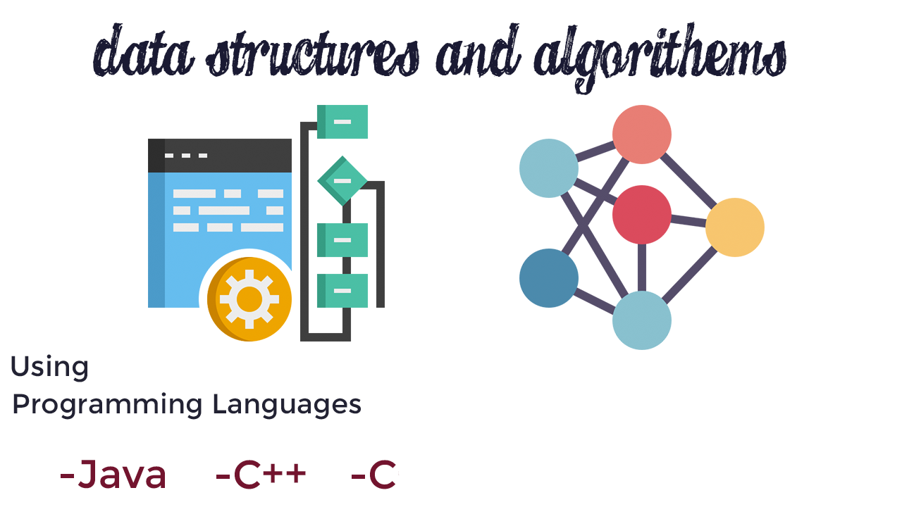

# Data Structures And Algorithms

1. Arrays
2. Linked List
    1. Singly Linked List (using C++ and Template & Generic in java)
    2. Doubly Linked List (using C++ and Template)
3. Stack
   1. Stack Array Implementation (java and C++ using resize with template)
   2. Solve String Reverse
   3. Balanced Expression
   4. Stack Linked list Implementation
4. Queue
   1. Standard Queue
   2. Stack Queue
   3. Circular Queue (Using java With Generics and C++ With Template)
   4. Priority Queue
   5. Reverse Queue
5. Hash Table
   1. Find First Non-Repeated Characters
   2. Find First Repeated Characters
   3. Build HashTable using Channing technique for solve Collision
# Algorithms
## Sorting
1. Bubble Sort
2. Selection Sort
3. Insertion Sort
4. 
## Searching
1. BinarySearch Using Iteration and Recursion ways (C++ with Template)